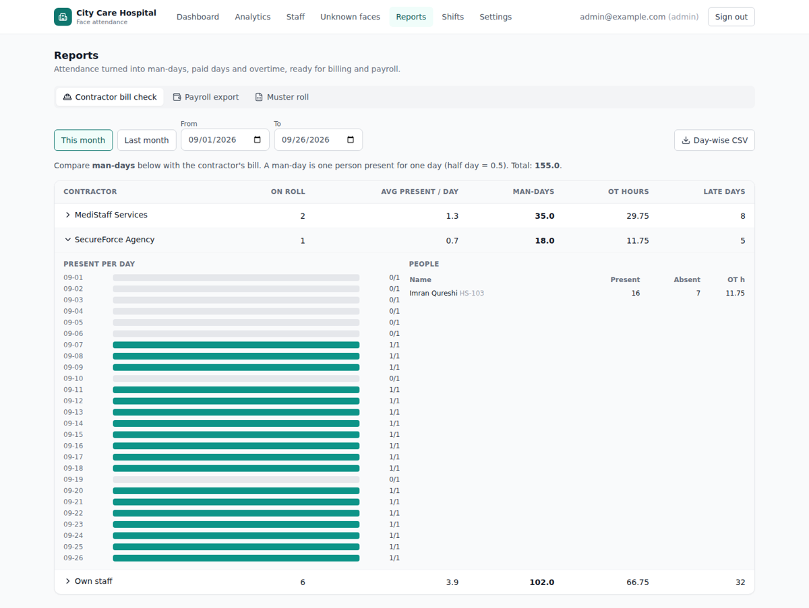
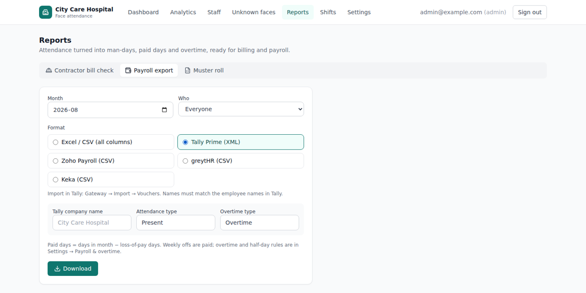
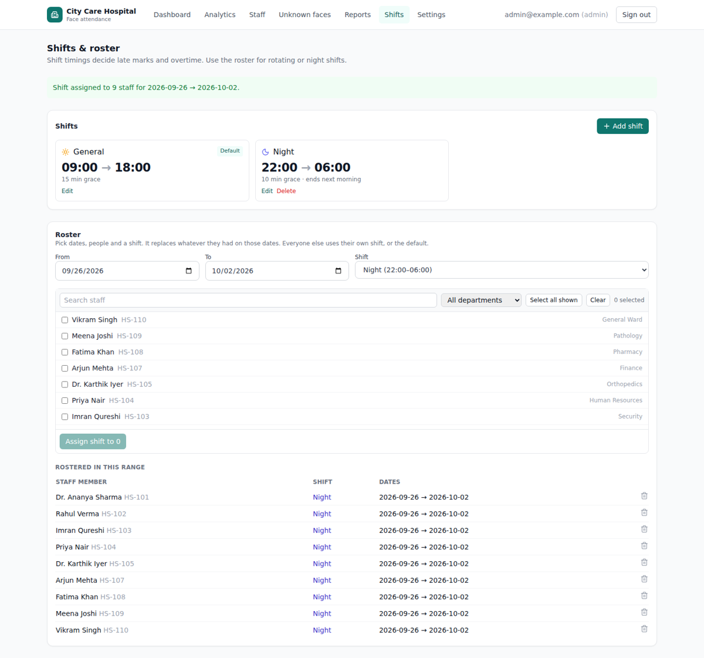
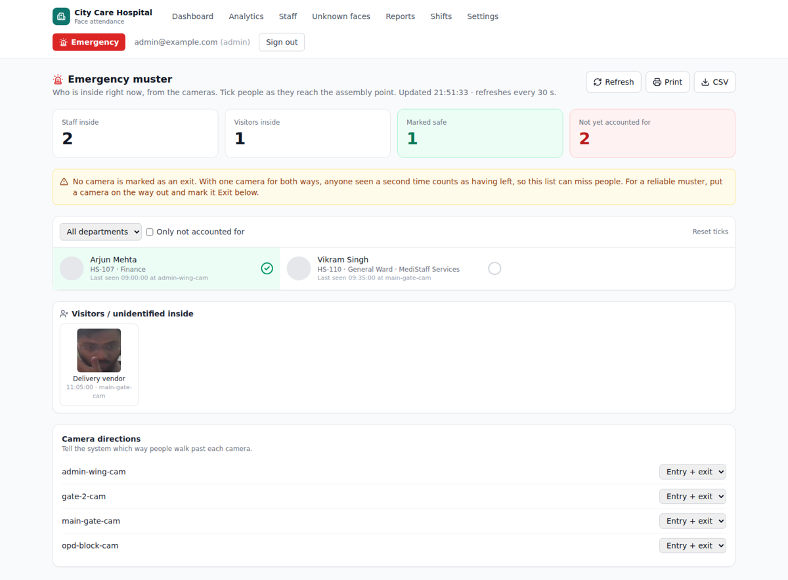
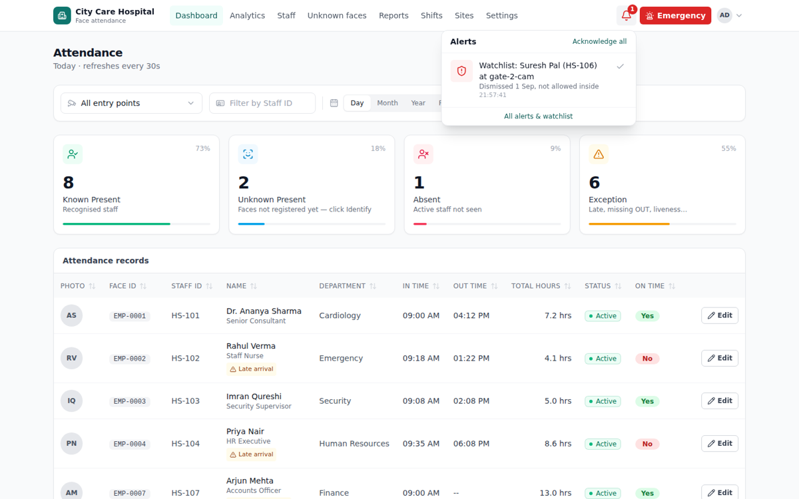
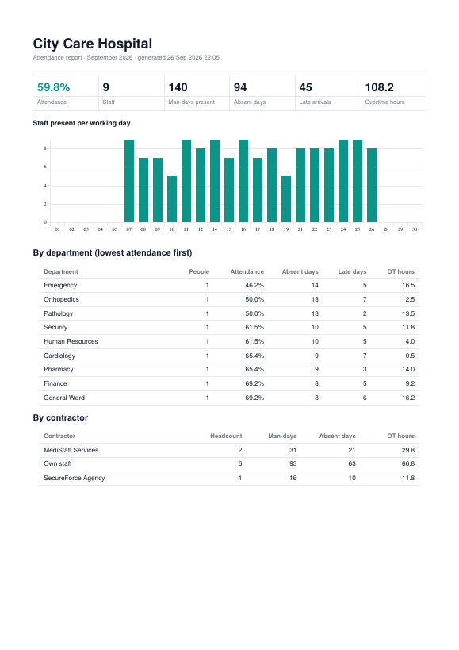
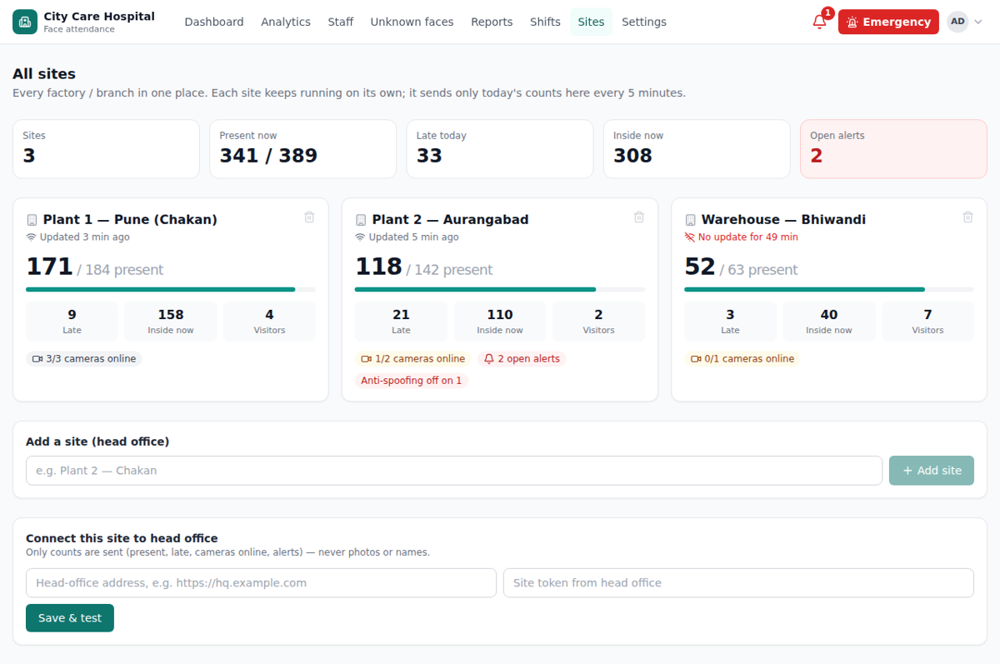
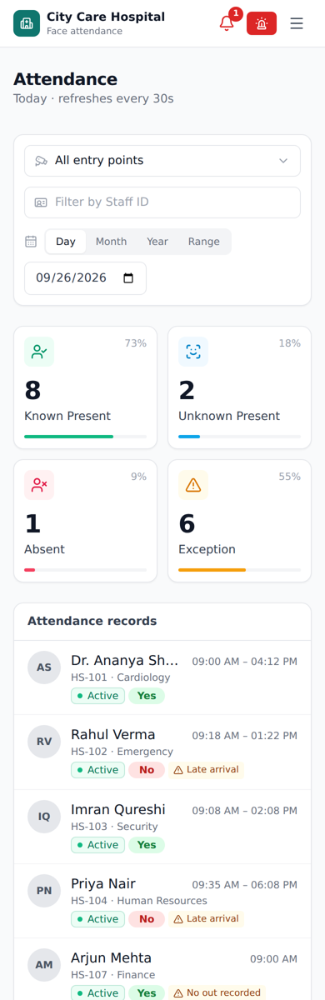

# Face Attendance: product update report (v2)

Date: 26 Sep 2026 · Branch: `feature/product-v2`

Is report ke 3 hisse hain:

1. **Kya naya hai**: 8 features, har ek kya karta hai aur kaise chalta hai
2. **Chalane ke liye kya karna hai**: update, setup, dhyan rakhne wali baatein
3. **Client pitch**: English me, seedha client ko dikhane ke liye

---

## 1. Ek nazar me

| # | Feature | Client ka kaunsa dard door karta hai | Kahan milega |
|---|---|---|---|
| 1 | Liveness (anti-spoofing) theek | "Photo ya phone dikha kar attendance lag jayegi?" | Apne aap chalta hai; Analytics me camera card |
| 2 | Contractor bill check | Contractor ke bill me man-days sahi hain ya nahi | Reports → Contractor bill check |
| 3 | Payroll export | Mahine ki salary ke liye attendance nikalna | Reports → Payroll export |
| 4 | Shift roster + overtime | Night shift, rotating shift, OT ka hisaab | Shifts page; Settings → Payroll & overtime |
| 5 | Emergency muster | Aag / emergency me "abhi andar kaun hai" | Header ka laal **Emergency** button |
| 6 | Watchlist alerts | Nikala gaya ya band kiya gaya aadmi dikhe to turant pata chale | Dashboard drawer → Watchlist; header ki bell |
| 7 | WhatsApp alerts + PDF report | Owner ko dashboard khole bina roz ke numbers mil jayen | Settings → WhatsApp; Reports → Monthly PDF |
| 8 | Mobile view + multi-site | Manager phone par dekhe; ek owner ki 3 factories ek jagah | Phone par apne aap; **Sites** page |

Saath me kuch purane bugs bhi theek kiye:

- Night shift me aane ka time overwrite ho jaata tha.
- "Add shift" button 422 error deta tha.
- Kuch galat form inputs par server 500 error deta tha.
- Current mahine ki report me aane wale din bhi "absent" gine jaate the.
- Repo me `node_modules`, `.env` aur `dev.db` commit ho gaye the. Ab ye track nahi hote.

---

## 2. Har feature detail me

### 2.1 Liveness (anti-spoofing): ab sach me kaam karta hai

**Pehle kya problem thi:** model ka download link galat tha (404) aur checksum ek placeholder tha. Isliye har install par liveness chupchaap **band** chal rahi thi, aur photo dikha kar bhi attendance lag sakti thi. Model ko pixel bhi galat scale me diye ja rahe the.

**Ab kya hota hai:**

- Do MiniFASNet models (V2 + V1SE) download hote hain, dono ka SHA-256 check hota hai, aur dono ka average score liya jaata hai. Ye upstream ka tareeka hai. Weights Apache-2.0 license ke hain, commercial use allowed hai.
- **Fail-closed:** agar model load nahi hua, to setting `liveness_required = true` (default) ki wajah se chehre **reject** hote hain, accept nahi. Isse installation ki galti turant dikh jaati hai.
- Analytics ke camera card par laal patti dikhti hai: "Anti-spoofing OFF". Head-office wale Sites page aur daily WhatsApp summary me bhi ye dikhta hai.
- Har camera ke liye threshold naapne ka tool:

  ```powershell
  cd kiosk
  python -m kiosk.liveness_check --label real  --seconds 30   # normal chal kar guzro
  python -m kiosk.liveness_check --label spoof --seconds 30   # phone par photo dikhao
  python -m kiosk.liveness_check --recommend                  # sahi threshold batayega
  ```

  Jo number aaye, use Settings → `liveness_threshold` me daal do. Default 0.5 hai.
- Jab koi photo ya screen dikhaye, to **spoof alert** bell par aata hai (aur WhatsApp par, agar set hai).

**Imaandari wali baat:** printout wali photo ye achhe se pakad leta hai. Lekin HD phone screen kabhi-kabhi nikal sakti hai. Har site par ek baar calibration zaroor karo. Offline site par dono `.onnx` files `MODEL_CACHE_DIR\minifasnet\` me haath se copy ki ja sakti hain.

### 2.2 Contractor bill check

- Har person par naya field **Contractor / agency** hai. Khaali chhodo to "Own staff".
- **Reports → Contractor bill check** me har contractor ke liye ye dikhta hai: on-roll log, roz ke present, **man-days** (half day = 0.5), OT ghante, late din.
- Kisi contractor par click karo to roz ka present chart aur har aadmi ki list khulti hai.
- **Day-wise CSV:** contractor × date × present. Isse contractor ke bill se line-by-line milaan kar sakte ho.



### 2.3 Payroll export

Mahina chuno, phir format chuno:

| Format | Kya milta hai |
|---|---|
| Excel / CSV (sab columns) | present, half day, absent, weekly off, paid days, LOP, late, OT, worked hours |
| Tally Prime (XML) | Attendance voucher (Tally Prime: Import → Transactions). Employee ke naam Tally se match hone chahiye. |
| Zoho Payroll / greytHR / Keka (CSV) | Employee ID, Paid Days, LOP Days, OT Hours, har tool ke apne column naam ke saath |

- Filter bhi hai: sab log, sirf own staff, ya ek contractor.
- **Paid days** = mahine ke din − LOP. Weekly off paid hota hai.
- **Muster roll** (Reports → Muster roll): register jaisi Excel sheet. Har aadmi ki ek row, har din ka ek column (P / A / HD / WO / WOP) aur aakhir me totals. Labour inspector aur contractor yahi maangte hain.

> Zoho, greytHR aur Keka ke column naam unke standard import templates se liye gaye hain. Pehle client ke paas unka apna downloaded template ek baar zaroor milaana. Farak ho to `backend/app/routers/reports.py` me `PAYROLL_HEADERS` badlo. Ye 1 line ka kaam hai.



### 2.4 Shift roster + overtime

- **Shifts page:** shift add, edit ya delete karo. Out time agar in time se pehle ho (22:00 → 06:00), to wo apne aap **night shift** maana jaata hai.
- **Roster:** dates chuno, log chuno (search ya department filter se), shift chuno, phir "Assign". Rotating shift ke liye har hafte ka roster daal do. Ek din par ek aadmi ki ek hi shift hogi; purani entries apne aap kat-chhat jaati hain.
- Kisi din ki shift ye tay karti hai: **roster entry → person ki fixed shift → default shift**.
- **Night shift theek:** 22:00 IN aur agli subah 06:00 OUT ab ek hi din gine jaate hain. Pehle subah wala dikhna "naye din ka IN" ban jaata tha aur raat ka arrival time kho jaata tha.
- **Settings → Payroll & overtime:**
  - Weekly off (din chuno)
  - OT on/off, minimum OT (default 30 min), rounding (default 15 min neeche ki taraf)
  - Full day / half day ke liye minimum ghante. Default 0 hai, kyunki sirf entry camera ho to log ek hi baar dikhte hain.
  - Night shift ki tail hours
  - Jin logon ki koi shift nahi, unke liye auto-detect
- **OT ka niyam:** shift khatam hone ke baad ka time. Weekly off par kaam kiya to poora time OT.



### 2.5 Emergency muster (abhi andar kaun hai)

- Header ke laal **Emergency** button se kisi bhi page se khulta hai.
- Andar maujood har staff aur visitor dikhta hai: photo, department, contractor, kab aur kis camera par last dikhe.
- **Roll call:** assembly point par log pahunchte jaayein, unhe tick karte jao. "Not yet accounted for" ka laal counter bata deta hai ki kitne log baaki hain. Print aur CSV bhi hai.
- **Camera directions:** har camera ko Entry, Exit ya Entry + exit mark karo.
  - Last dikhe Entry camera par → andar
  - Last dikhe Exit camera par → bahar
  - Ek hi camera dono taraf ke liye → pehli baar dikhe to andar, dobara dikhe to bahar
- Sahi muster ke liye **exit par alag camera** chahiye. Jab tak nahi hai, page par peeli chetavni dikhti hai.



### 2.6 Watchlist + alerts

- **Watchlist me kaise daalein:**
  - Dashboard par kisi row ka drawer → **Watchlist** tab → kaaran likho. Ye unknown face aur registered person dono ke liye hai.
  - Ya Staff page par person kholo → "Watchlist reason" bharo.
- Us insaan ko koi bhi camera dekhe, to header ki **bell** laal ho jaati hai. Beep bajta hai, taaki guard desk sun le. Photo ke saath alert dikhta hai aur WhatsApp par bhi jaata hai.
- Ek hi aadmi camera ke saamne khada ho to alerts ki baarish nahi hoti: ek aadmi ke liye 30 min me ek alert, spoof ke liye ek camera par 10 min me ek.
- **Alerts page** par poori history (kisne acknowledge kiya) aur watchlist ki list hai, jahan se naam hataya bhi ja sakta hai.



### 2.7 WhatsApp + monthly PDF

- **Settings → WhatsApp & notifications**, do tareeke:
  - **Meta WhatsApp Cloud API:** phone number ID, access token, numbers, aur template ke naam. Har template me ek variable `{{1}}` hona chahiye. Template khaali chhodo to plain text jaata hai, jo sirf testing ke liye theek hai.
  - **Webhook:** Interakt, AiSensy, Gupshup jaise reseller, ya Slack/Teams.
- **Kya jaata hai:**
  - Har alert, turant
  - Roz ek set time par summary. Example: "City Care Hospital — 26 Sep: 171/184 present (93%), 13 absent, 9 late. 3/3 cameras online. Open alerts: 0."
  - Har mahine ki 1 tareekh ko pichhle mahine ka summary
- "Save & send test" aur "Send today's summary now" buttons demo ke waqt kaam aate hain.
- Access token API se kabhi wapas nahi dikhta.
- **Reports → Monthly PDF:** 2 page ki report:
  - KPI tiles (attendance %, man-days, absent, late, OT)
  - Roz ka chart
  - Department aur contractor tables
  - Sabse kam attendance wale aur sabse zyada late wale log



### 2.8 Mobile view + multi-site

- **Mobile:**
  - Header ek line ka ho gaya hai: menu button, bell aur Emergency.
  - KPI cards 2 column me aate hain.
  - Attendance ki 10 column wali table phone par card list ban jaati hai.
  - Kisi bhi page par horizontal scroll nahi aata (sab pages check kiye).
- **Multi-site:** har factory ka apna install alag chalta hai (cameras local network par, internet ke bina bhi). Head office ke liye ek install hota hai (chhota cloud VM ya office ka PC).
  1. Head office par: Sites → "Add site" → site ka token milta hai (sirf ek baar dikhta hai).
  2. Factory par: Sites → "Connect this site to head office" → head office ka address aur token daalo → "Save & test".
  3. Har factory har 5 minute me sirf **ginti** bhejti hai: present/roster, late, andar kitne, cameras online, open alerts. Photo, naam ya face data kabhi bahar nahi jaata. Sirf outbound HTTPS lagta hai, router par port forwarding ki zaroorat nahi.
  4. Jis site ka update 15 min se nahi aaya, wo laal dikhti hai.





---

## 3. Update kaise karein (aapke PC par)

1. Code lao (GitHub par push nahi ho paya, isliye bundle file se):

   ```powershell
   cd "D:\DS PROJECTS\face-attendance"
   git fetch .\feature-product-v2.bundle feature/product-v2:feature/product-v2
   git checkout feature/product-v2
   git push -u origin feature/product-v2      # GitHub par bhi chala jayega
   ```

2. Backend me ek nayi library aayi hai (PDF ke liye):

   ```powershell
   cd backend
   .venv\Scripts\Activate.ps1
   pip install -r requirements.txt
   ```

3. Backend restart karo. Database ke 3 naye badlav (`0003`, `0004`, `0005`) **apne aap** lag jayenge. Aapki asli DB ki copy par ye test kiya gaya hai: 100 log aur 2472 events, sab sahi bache.
4. Kiosk restart karo. Pehli baar liveness models (lagbhag 3.5 MB) GitHub se download honge, internet chahiye.
5. Frontend: `npm install` (koi naya package nahi hai), phir `npm run dev` ya `npm run build`.
6. Har camera par liveness calibration karo (section 2.1).

**Naye client ke liye** `docs/CLIENT_ONBOARDING.md` wale steps ke baad ye bhi karo:

- Contractors ke naam daalo
- Shifts aur roster set karo
- Weekly off aur OT ke niyam set karo
- Camera directions (entry/exit) mark karo
- WhatsApp numbers daalo
- Multi-site ho to Sites page par connect karo

### Test results

| Hissa | Nateeja |
|---|---|
| Backend | 69 tests pass (26 naye: timesheet, night shift, roster, reports, muster, alerts, multi-site, WhatsApp, PDF), ruff aur mypy clean |
| Kiosk | 105 pass. 5 fail jo pehle se the aur is sandbox me GPU/insightface na hone ki wajah se hain, code ki wajah se nahi |
| Frontend | TypeScript, ESLint aur 26 tests clean, production build OK |
| Browser | Har naya page Playwright me desktop aur phone (390px) par khola: koi console error nahi, koi failed API call nahi |

### Abhi bhi baaki / dhyan rakhein

- **InsightFace license:** commercial sale se pehle lena hai (pehle bataya tha).
- **Liveness:** har camera par calibration zaroori hai. HD phone screen 100% nahi pakdi jaati.
- **Payroll formats:** Zoho, greytHR aur Keka ke column naam client ke template se ek baar milaane hain.
- **Tally:** XML ko pehle client ki Tally company ki ek copy par import karke test karo. Attendance types ("Present", "Overtime") Tally company me pehle se bane hone chahiye; page par unke naam badal sakte ho.
- **WhatsApp Cloud API:** Meta Business verification aur template approval me 1–3 din lagte hain. Tab tak webhook ya reseller use karo.
- **Night shift aur dashboard:** Reports, payroll aur muster night shift sahi ginte hain. Lekin Dashboard ka "aaj" view ab bhi calendar din ke hisaab se hai, isliye raat 12 ke baad wale sighting agle din me dikhte hain.
- **Git history:** repo ki purani history me `.env` aur `dev.db` ab bhi hain. Repo private rakho, ya history saaf karwao.

---

## 4. Client pitch (English — show this to the client)

### Attendance that runs itself, on the cameras you already have

**The problem.** Card punching and fingerprint machines mean queues at shift change, buddy-punching, dirty or gloved hands that don't scan, and HR spending days every month reconciling attendance, overtime and contractor bills by hand.

**What we install.** Face recognition on your existing CCTV / IP cameras at each entry point. People just walk through, with no stopping, touching or queue. Everything runs on a PC on your premises, and faces never leave your building.

**What you get:**

| For | You get |
|---|---|
| Owner / management | Live dashboard and phone view: who's in, who's late, who's absent, by camera and department. Daily WhatsApp summary. Monthly PDF report. All your plants on one screen. |
| HR / payroll | Payroll-ready exports for Tally, Zoho, greytHR and Keka. Paid days, loss-of-pay and overtime calculated automatically. Night and rotating shifts handled. |
| Contractor management | Man-days per contractor per day, to check every bill line by line. |
| Security / safety | Anti-spoofing (a photo or phone screen can't mark attendance). Instant alert when a watch-listed person walks in. One-click emergency muster with a roll call of everyone inside. |
| Compliance | Muster roll register, consent capture, full audit trail of every correction. Data stays on-premise (DPDP-friendly). |

**Why us, not an app or a biometric machine:**

- **No new hardware at every gate.** It uses the cameras you already have, and each camera handles up to 200 people.
- **No queue, no touch.** People are recognised while walking.
- **Built for Indian workplaces:** contractors, night shifts, weekly offs, and Tally/Indian payroll formats.
- **Works offline.** Attendance keeps recording through internet outages.
- **Runs on your site.** Your employees' faces are never uploaded to someone else's cloud.

**How we roll out:**

1. **Week 1.** Site survey, camera placement and a 30-day pilot at one entry point.
2. **Week 2–4.** Enrol staff, set shifts and contractors, connect payroll and WhatsApp.
3. **Go-live.** Training for HR and security, then monthly review with the PDF report.

*Suggested pricing (validate in pilots): one-time setup plus a per-camera (entry point) monthly subscription. See the earlier pricing note for ranges.*


